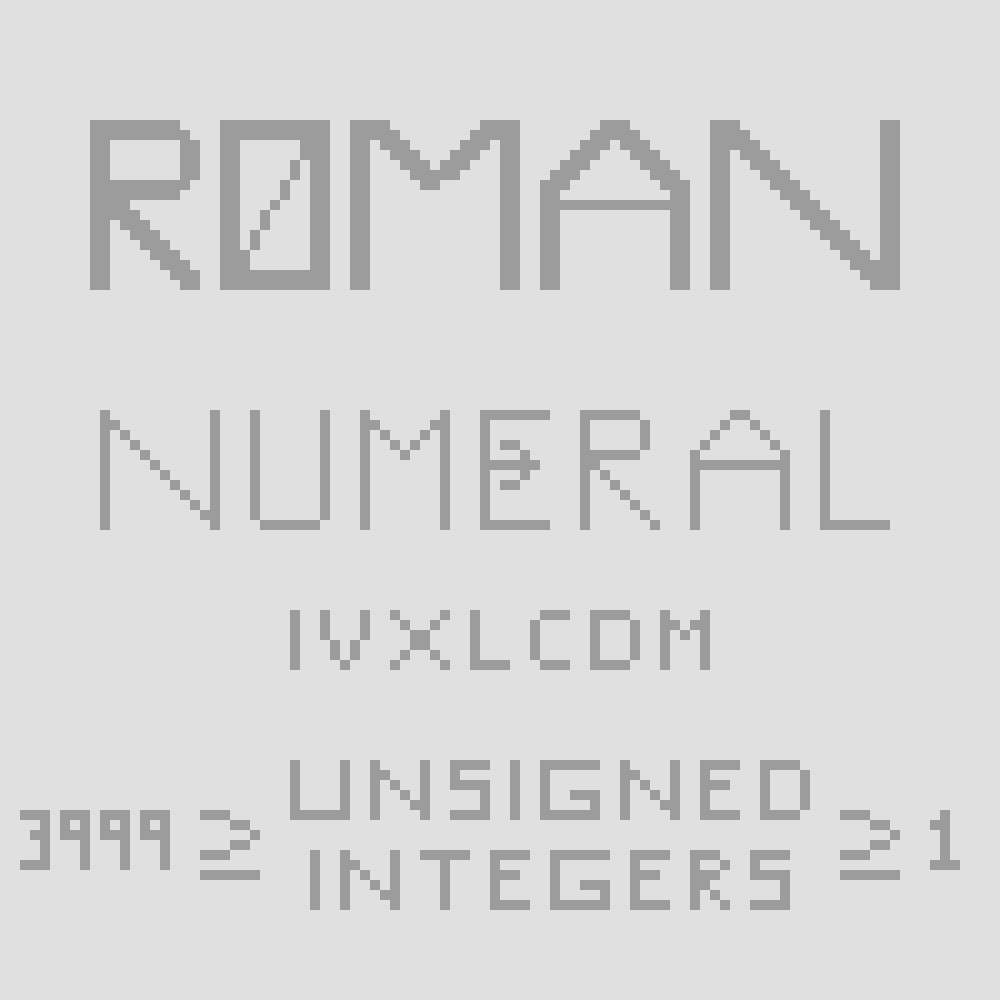

# roman-numeral-integer
This is a data structure that can show an integer value between 1 and 3999 as a roman numeral.
Project was created using solely C++.
  

  
Using the RomanNumeral data structure, you can convert an integer to a roman numeral value and vice versa.
Through operator overloading, the program makes it possible to perform several arithmetic operations on:
- a RomanNumeral object and a RomanNumeral object
- an integer and a RomanNumeral Object
